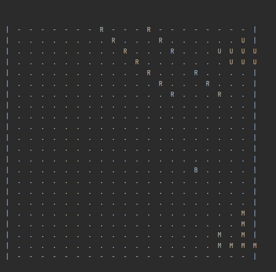
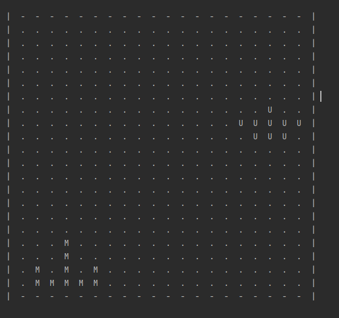
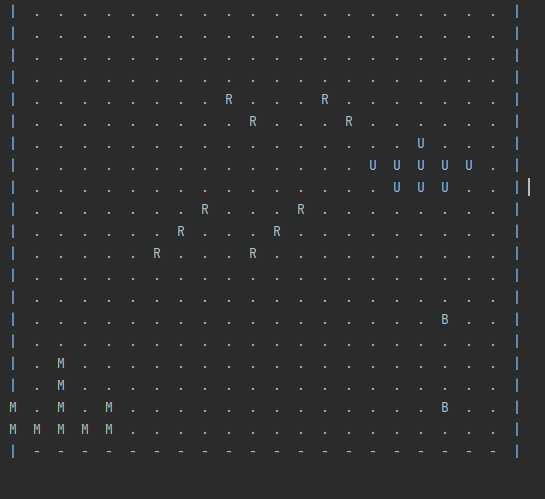

# README

# Space Invaders Console Game on Java 

## Description

This is modelling of Space Invaders Game built using instructions from javarush.ru

## Built With

- Java

## How it looks

Where the object drawn with "M" is the Ship, "R" are the rockets from the Ship, the object drawn with "U" is the UFO, "B" is the bomb from the UFO 

## Authors

👤 **Ilie Babcenco**

- GitHub: [@iliebabcenco](https://github.com/iliebabcenco)
- LinkedIn: [@iliebabcenco](https://www.linkedin.com/in/ilie-babcenco-72459a1b1/)
- Twitter: [@iliebabcenco](https://twitter.com/BabcencoIlie)

## 🤝 Contributing

Contributions, issues, and feature requests are welcome!

If you want to contribute, you can clone this project or fork it.

If you found an issue, feel free to check the [issues page](https://github.com/iliebabcenco/blog-rails-app/issues).

## Show your support

Give a ⭐️ if you like this project!
